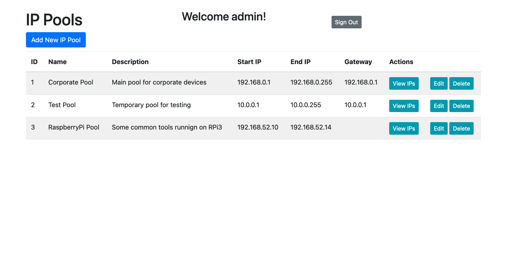
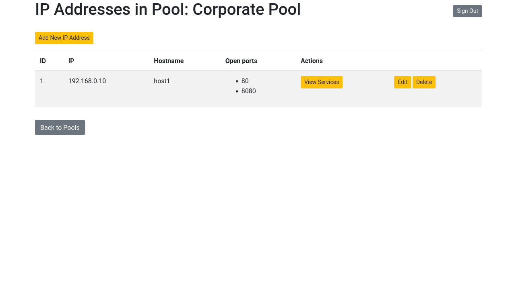
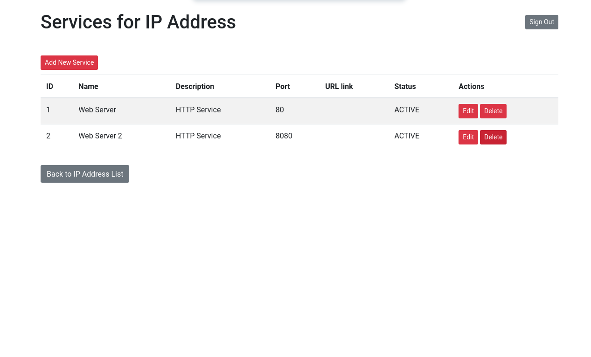

# IP-Address-Management-System
This project is made for Back End Programming Course at Haaga-Helia UAS. This web-based application are designed to streamline the management of IP addresses and associated network recources. With this application you can monitor, and maintain IP address pools, track device assigments, and manage related network configurations.

## Features
- **User Authentication**: Secure user authentication to access the application.
- **Role-Based Access Control**:User roles(Admin, User) with speciific permissions for actions like adding, editing, or deleting IP addresses.
- **IP Management**: Create, view, update and delete IP pools, including defining start and end IP ranges and gateways.
- **IP Address Management**:Add, edit, delete, and assign individual IP addresses to devices or services.
- **Services Association**:Link IP addresses with specific network services and track their current usage and status.
- **Service Status Monitoring**: View and update service statuses associated with IP addresses.
- **Responsive Design**:Mobile-friendly interface.

## IP Pools Main Page



## IP Addresses Page



## IP Services Page



## Try it yourself
This site was deployed using [our own home server](https://ipms.tylencloud.com/login).

```
username: user
password: user
```

## Technologies Used
- **Spring Boot**
- **Spring Security**
- **MySQL**

## Prerequisites

Before running the application, ensure that you have the following software installed on your system:

- **Maven**
- **Docker**
- **Java**

## Environment Configuration

To configure the application, you need to create a `.env` file in the root directory of the repository. This file will contain the necessary environment variables for the web application and database connection.

### Example `.env` File

```dotenv
WEB_APP_PORT="3000"
DB_USERNAME="davylis"
DB_PASSWORD="password"
DB_URL="jdbc:mysql://localhost:3306/database?useUnicode=true&useJDBCCompliantTimezoneShift=true&useLegacyDatetimeCode=false&serverTimezone=UTC"
```

# Deployment Phases

The deployment process consists of two main phases:

1. **Database Setup**
2. **Application Deployment**

## 1. Database Setup

## Start the Database Container

To deploy the database, navigate to the `ip-management-system` folder and execute the following command in your terminal:

```bash
docker-compose -f mysqldb.yaml up -d
```

This command will start the MySQL database container in detached mode.

## 2. Application Deployment

Once the database is up and running, you can deploy the application and connect it to the database.

### Build the Application

In the same folder run the following command to build the application:

```bash
mvn clean package -DskipTests
```

This command will compile the application and package it into a JAR file, skipping the tests for faster execution.

### Run the Application

After the JAR file is built and placed in the `./target` directory, you can run the application using the following command:

```bash
java -jar ./target/ip-management-system-0.0.1-SNAPSHOT.jar
```

## Conclusion

By following these steps, you will successfully deploy the application and connect it to the MySQL database running in a Docker container. If you encounter any issues, please refer to the logs for troubleshooting or consult the project documentation for further assistance.


